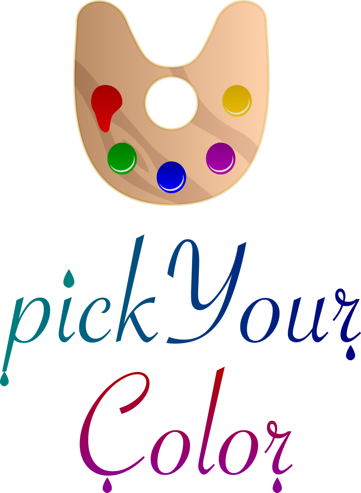

  

## What is it?

pickYourColor is about people that work with colours. Very often, developers and designers are working with some random palette and waste tons of time looking for his palette, selecting the hexa and hitting **&#8984; + C**. The main idea of **pickYourColor** is to serve as a *"toolbelt"*, by the side of the computer, in the smartphone, making good use of the *universal clipboard*.

## Stage

In development, initial stage.
Issues, PRs and ideas are welcome.

## License 

[MIT License](https://github.com/feliborgez/pickYourColor/blob/master/LICENSE)
